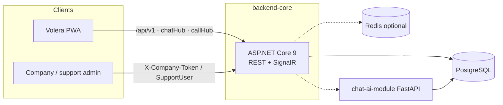

# Volera

**Real-time chat, voice calls, and company support — in one platform.**

Volera is a multi-product messaging stack: a consumer PWA for 1:1 and group chat plus calls, a company widget / support portal, a .NET 9 API with SignalR, and an optional FastAPI AI agent with RAG.

[](backend-core/)
[](velora-frontend/)
[](docs/architecture.md)
[](#)

---

## What you get

| Product surface | What it does |
|-----------------|--------------|
| **Volera PWA** (`velora-frontend`) | End-user chat, groups, voice / group calls, web push, offline-friendly send/sync, platform admin at `/admin` |
| **Company admin** (`admin-panel`) | Widget SaaS: company settings, support agents, AI widget content |
| **API** (`backend-core`) | REST (`/api/v1`), SignalR hubs, EF Core, Hangfire, outbox delivery |
| **AI module** (`chat-ai-module`) | FastAPI agent + embeddings / RAG against the same Postgres |

### Highlights

- 1:1 and **group chat**, guest chat, and **company support widgets**
- **Voice and group calls** over SignalR (JWT on authenticated hubs)
- **Reliable messaging**: IndexedDB queue + `clientMessageId` idempotency, transactional outbox, `POST /api/v1/Message` and `GET /api/v1/Message/sync`
- Auth split by audience: user **Bearer**, support **SupportUser**, company **`X-Company-Token`**
- Optional **AI widget** (Ollama by default) with tenant-scoped RAG
- Structured logging (**Serilog → Seq**) without tokens or message bodies in logs

---

## Architecture



Clean Architecture on the backend:

`Shared` ← `Core.Domain` ← `Core.Application` ← `Infrastructure`  
`WebAPI` composes the app (thin controllers, hubs, middleware).

| Hub | Path | Auth |
|-----|------|------|
| Call | `/callHub` | JWT |
| Chat | `/chatHub` | JWT |
| Guest | `/guestHub` | Anonymous |
| Company widget | `/companyWidgetHub` | Anonymous |
| Support | `/supportHub` | SupportUser JWT |
| AI widget | `/aiWidgetHub` | Anonymous |

Hub JWT is accepted from query `access_token`.

---

## Repository layout

| Path | Role | Stack |
|------|------|--------|
| [`backend-core/`](backend-core/) | API, SignalR, EF Core, Hangfire | .NET 9, MediatR CQRS, PostgreSQL (Npgsql) |
| [`velora-frontend/`](velora-frontend/) | Consumer PWA + platform `/admin` | React 19, Vite 7, Zustand, Tailwind 4 |
| [`admin-panel/`](admin-panel/) | Company widget + support portal | Next.js 14, Tailwind 3 |
| [`chat-ai-module/`](chat-ai-module/) | AI agent + RAG | Python 3.11+, FastAPI, Ollama |
| [`docs/`](docs/) | Architecture, API, deploy, security | Markdown |
| [`.cursor/`](.cursor/) | Cursor rules and agent skills for this repo | Project conventions |

There is no root .NET solution. Backend solution: `backend-core/VoiceCallApp.sln`.

---

## Prerequisites

- **.NET 9** SDK
- **Node.js 22** and npm
- **PostgreSQL 16+** (local or Docker)
- Optional: **Python 3.11+** and [Ollama](https://ollama.ai) for the AI widget
- Optional: Docker Compose for API + Postgres + PWA

Copy env templates only — never commit real secrets:

- `backend-core/.env.example`
- `admin-panel/.env.local.example`
- `chat-ai-module/.env.example`

Supply `Jwt:Key`, `ConnectionStrings:DefaultConnection`, and `POSTGRES_PASSWORD` via environment or user secrets. Startup expects a strong JWT signing key.

---

## Quick start

### Backend

```bash
cd backend-core
dotnet restore VoiceCallApp.sln
dotnet ef database update --project src/Infrastructure --startup-project src/WebAPI
dotnet run --project src/WebAPI
```

API: **http://localhost:5002** (`launchSettings.json`). Health: `GET /health`.

### Volera PWA

```bash
cd velora-frontend
npm ci
npm run dev
```

Vite proxies `/api` and hubs to `localhost:5002`. Optional: `VITE_API_URL`.

Calls need a **secure context** (HTTPS or localhost). LAN microphone access is documented in [`docs/development.md`](docs/development.md).

### Company admin

```bash
cd admin-panel
cp .env.local.example .env.local   # NEXT_PUBLIC_API_URL=http://localhost:5002
npm install
npm run dev
```

### AI module (optional)

```bash
cd chat-ai-module
python -m venv .venv
pip install -r requirements.txt
cp .env.example .env               # DATABASE_URL = same Postgres as the API
uvicorn main:app --reload --host 0.0.0.0 --port 8000
```

Set backend `AiService:BaseUrl` to `http://localhost:8000`.

---

## Docker

From `backend-core/` (requires `.env` with `POSTGRES_PASSWORD`):

```bash
cp .env.example .env
docker compose --env-file .env up -d --build
```

| Service | URL |
|---------|-----|
| Volera (nginx) | http://localhost |
| API | http://localhost:5000 |
| Health | `GET /health` |

Compose runs **webapi**, **postgres:16-alpine**, and the **velora-frontend** image. It does not currently include Redis, admin-panel, or chat-ai-module.

---

## Tests

```bash
cd backend-core && dotnet test VoiceCallApp.sln
cd chat-ai-module && pytest tests/ -v
```

Frontends expose `lint` / `build`. Backend tests: xUnit + Moq (often EF InMemory).

---

## Documentation

| Doc | Contents |
|-----|----------|
| [AGENTS.md](AGENTS.md) | Conventions for coding agents |
| [docs/architecture.md](docs/architecture.md) | Layers, hubs, data stores |
| [docs/development.md](docs/development.md) | Local setup, HTTPS for calls |
| [docs/api.md](docs/api.md) | HTTP / SignalR surface |
| [docs/security.md](docs/security.md) | Auth schemes, secrets, logging hygiene |
| [docs/logging.md](docs/logging.md) | Serilog → Seq event conventions |
| [docs/testing.md](docs/testing.md) | How tests are organized |
| [docs/message-state-machine.md](docs/message-state-machine.md) | Message delivery states |
| [docs/resilience-international-shutdown.md](docs/resilience-international-shutdown.md) | Offline-first / retry |
| [docs/DEPLOY-SERVER.md](docs/DEPLOY-SERVER.md) | Server + GitHub Actions deploy |

CI: [`.github/workflows/deploy.yml`](.github/workflows/deploy.yml) — restore/build/test backend, build frontend, then SSH deploy + Compose.

---

## Agent / Cursor notes

This repo includes [`.cursor/rules`](.cursor/rules) (architecture, backend, frontend, security, testing, database) and [`.cursor/skills`](.cursor/skills). Follow **AGENTS.md**: small diffs, no secrets in commits, do not mix platform admin (`velora-frontend` `/admin`) with company admin (`admin-panel`).

---

## Naming

The consumer product is **Volera**. The PWA lives in `velora-frontend` for historical folder naming — treat **Volera** as the product name in UI, JWT issuer, and docs.
