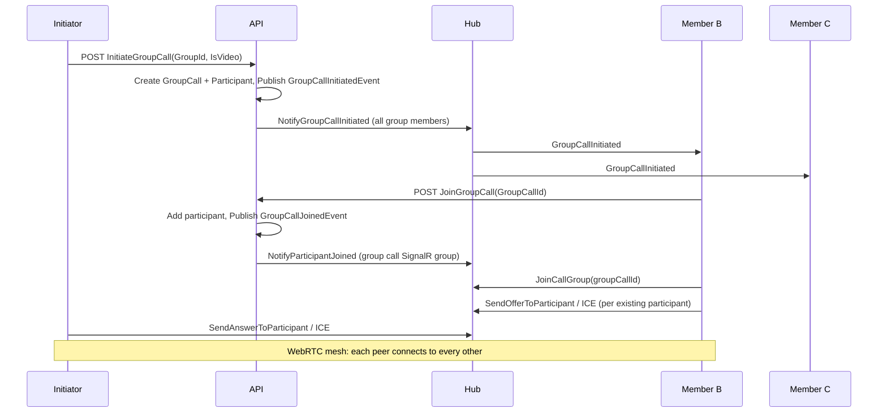

# Group video/voice call (DDD + CQRS)

## Context

The app already has **1:1 voice/video call** implemented with:

- **Domain:** [Call](backend/src/Core.Domain/Entities/Call.cs) entity (CallerId, ReceiverId, Status, IsVideo) and domain events (CallInitiated, Accepted, Rejected, Ended, Missed).
- **Application:** CQRS via MediatR ([InitiateCallCommand](backend/src/Core.Application/Commands/InitiateCallCommand.cs), Accept/Reject/End, [GetCallsByUserIdQuery](backend/src/Core.Application/Queries/GetCallsByUserIdQuery.cs)); [DomainEventHandler](backend/src/Core.Application/Handlers/DomainEventHandler.cs) subscribes to call events and calls [ICallNotificationService](backend/src/Core.Application/Interfaces/ICallNotificationService.cs).
- **Infrastructure:** [CallRepository](backend/src/Infrastructure/Repositories/CallRepository.cs) (EF Core, PostgreSQL).
- **WebAPI:** [CallController](backend/src/WebAPI/Controllers/CallController.cs), [CallHub](backend/src/WebAPI/Hubs/CallHub.cs) (SignalR: JoinCallGroup, signaling), [CallNotificationService](backend/src/WebAPI/Services/CallNotificationService.cs).
- **Frontend:** [callService](backend/frontend/src/services/callService.ts), [useCallStore](backend/frontend/src/store/useCallStore.ts) (single RTCPeerConnection, offer/answer/ICE via SignalR), [CallModal](backend/frontend/src/components/CallModal.tsx).

Group call will follow the same patterns and integrate with existing [Group](backend/src/Core.Domain/Entities/Group.cs) / [GroupMember](backend/src/Core.Domain/Entities/GroupMember.cs) so only group members can join.

---

## Architecture overview

---

## 1. Domain layer (Core.Domain)

- **New entity: GroupCall**
  - Id, GroupId (FK to Group), InitiatorId (FK to User), StartTime, EndTime (nullable), IsVideo, Status (e.g. Ringing, Active, Ended).
  - Navigation: Group, Initiator (User).
  - Behavior: `Start()`, `End()`, and optionally `AddParticipant(userId)` / `RemoveParticipant(userId)` if you model participants as part of the aggregate; alternatively participants are a separate entity and GroupCall only tracks start/end/initiator.
- **New entity: GroupCallParticipant**
  - Id, GroupCallId (FK), UserId (FK), JoinedAt, LeftAt (nullable). Represents one user’s presence in a group call.
  - Used to know who is in the call (for signaling and UI) and for history.
- **New domain events:** GroupCallInitiatedEvent(GroupCallId, GroupId, InitiatorId, IsVideo), GroupCallJoinedEvent(GroupCallId, UserId), GroupCallLeftEvent(GroupCallId, UserId), GroupCallEndedEvent(GroupCallId, InitiatorId).
- **New repository interface:** IGroupCallRepository (e.g. Add(GroupCall), GetByIdWithParticipants, GetActiveByGroupId, Update).
- **Persistence:** Add DbSets for GroupCall and GroupCallParticipant in [ApplicationDbContext](backend/src/Infrastructure/Persistence/ApplicationDbContext.cs), configure relationships and indexes. New EF migration.

---

## 2. Application layer (Core.Application) – CQRS

**Commands and handlers:**

- **InitiateGroupCallCommand** (GroupId, InitiatorId, IsVideo) → GroupCallId  
  - Validate: user is member of group; no active group call for that group (or define policy: e.g. allow one active per group). Create GroupCall (Ringing/Active), add Initiator as first GroupCallParticipant, persist, publish GroupCallInitiatedEvent.
- **JoinGroupCallCommand** (GroupCallId, UserId) → success  
  - Validate: group call exists and is Active/Ringing; user is member of the group. Add GroupCallParticipant (JoinedAt, LeftAt null), persist, publish GroupCallJoinedEvent.
- **LeaveGroupCallCommand** (GroupCallId, UserId)  
  - Set LeftAt for participant, persist, publish GroupCallLeftEvent. If last participant leaves, optionally End group call and publish GroupCallEndedEvent.
- **EndGroupCallCommand** (GroupCallId, UserId)  
  - Only initiator (or any participant, depending on product rule) can end for everyone. Set EndTime on GroupCall, set LeftAt for all remaining participants, persist, publish GroupCallEndedEvent.

**Queries and handlers:**

- **GetActiveGroupCallByGroupIdQuery** (GroupId) → GroupCallDto or null (with participant list).  
  - For showing “Join” in group chat when a call is active.
- **GetGroupCallHistoryQuery** (GroupId, Page, PageSize) → paginated list of past group calls (optional, for history UI).

**DTOs:** GroupCallDto, GroupCallParticipantDto (id, userId, userName, joinedAt, leftAt, etc.) as needed by API and frontend.

**Domain event handling:** In [DomainEventHandler](backend/src/Core.Application/Handlers/DomainEventHandler.cs) (or a dedicated GroupCallDomainEventHandler), subscribe to GroupCallInitiatedEvent, GroupCallJoinedEvent, GroupCallLeftEvent, GroupCallEndedEvent and call a new **IGroupCallNotificationService** to push SignalR messages (see below). Keep 1:1 call events handled as today.

---

## 3. Application interface and WebAPI notification service

- **IGroupCallNotificationService** (in Core.Application.Interfaces):  
  - SendGroupCallInitiated(GroupCallId, GroupId, InitiatorId, InitiatorName, IsVideo, List of member user ids to notify).  
  - SendParticipantJoined(GroupCallId, UserId, UserName).  
  - SendParticipantLeft(GroupCallId, UserId).  
  - SendGroupCallEnded(GroupCallId).
- **GroupCallNotificationService** (in WebAPI): Implements the above using IHubContext (reuse existing hub). Notify group members by resolving their connection ids (ConnectionManager) or by user id; for “group call room” signaling, use a SignalR group named e.g. `GroupCall_{groupCallId}` so all participants join the same group.

---

## 4. SignalR (CallHub) and API surface

- **Reuse [CallHub](backend/src/WebAPI/Hubs/CallHub.cs):**
  - **JoinGroupCallGroup(string groupCallId)** – add connection to group `GroupCall_{groupCallId}`.
  - **LeaveGroupCallGroup(string groupCallId)** – remove from that group.
  - **SendOfferToParticipant(string groupCallId, string targetUserId, string offer)** – send to that user (or to group with target in payload so only target handles it).
  - **SendAnswerToParticipant(string groupCallId, string targetUserId, string answer)** – same idea.
  - **SendIceCandidateToParticipant(string groupCallId, string targetUserId, string candidate)** – same.
  Alternatively, “SendToParticipant” can be implemented as “send to group with payload containing targetUserId” so the frontend only applies offer/answer/ICE when targetUserId matches self.
- **New or extended controller:** GroupCallController (or under existing [GroupController](backend/src/WebAPI/Controllers/GroupController.cs)):  
  - POST `api/GroupCall/initiate` (body: GroupId, IsVideo) → { groupCallId }.  
  - POST `api/GroupCall/{groupCallId}/join`.  
  - POST `api/GroupCall/{groupCallId}/leave`.  
  - POST `api/GroupCall/{groupCallId}/end` (end for all).  
  - GET `api/GroupCall/active/{groupId}` → active group call info + participants (for “Join” button).  
  - Optional: GET `api/GroupCall/history/{groupId}` for history.

All actions authorize the user and ensure they are members of the group (via IGroupRepository.GetGroupWithMembersAsync or similar).

---

## 5. Frontend

- **Group call API client** (e.g. in [api.ts](backend/frontend/src/services/api.ts) or `groupCallService.ts`):  
  - initiateGroupCall(groupId, isVideo), joinGroupCall(groupCallId), leaveGroupCall(groupCallId), endGroupCall(groupCallId), getActiveGroupCall(groupId).
- **Group call state and signaling:** New store (e.g. `useGroupCallStore`) or extend [useCallStore](backend/frontend/src/store/useCallStore.ts):  
  - State: activeGroupCallId, groupId, initiatorId, participants (list of { userId, userName, stream? }), isVideo, localStream, status (idle | ringing | connecting | connected), connection (SignalR).  
  - On “Start group call”: call initiateGroupCall, then join SignalR group `GroupCall_{groupCallId}`, set status to “ringing” (waiting for others).  
  - On “GroupCallInitiated” (received by other members): show incoming group call UI with “Join” / “Decline”.  
  - On “Join”: call joinGroupCall API, then JoinGroupCallGroup on hub, get user media, and establish **mesh WebRTC**: for each existing participant, create an RTCPeerConnection (or one per peer), create offer, send via SendOfferToParticipant; on ReceiveOffer from X, create answer and send SendAnswerToParticipant to X; exchange ICE via SendIceCandidateToParticipant. Store remote streams by userId so UI can render multiple remote videos.  
  - On “ParticipantJoined”: new peer: if self is already in call, create offer toward the new joiner and send; new joiner will send offers to everyone.  
  - On “ParticipantLeft” / “GroupCallEnded”: remove that peer’s stream and close the corresponding RTCPeerConnection; if ended, reset state and close all.
- **WebRTC mesh:** Maintain a map of `userId -> RTCPeerConnection` (and optionally `userId -> MediaStream`). When a new participant is added, create a new peer connection for that user and run offer/answer + ICE with them. Scale note: mesh is acceptable for small groups (e.g. 4–6); for larger groups an SFU (e.g. mediasoup, Janus) would be a later backend/frontend change.
- **UI:**  
  - From [Chat.tsx](backend/frontend/src/pages/Chat.tsx) when [selectedGroup](backend/frontend/src/pages/Chat.tsx) is set, show “Voice call” / “Video call” buttons (reuse Phone/Video icons).  
  - New “GroupCallModal” (or extend CallModal with a “group” mode): show local video and a grid of remote participants (by userId), mute/video toggle, leave and (if initiator) end-for-all buttons.  
  - Optional: “Active group call” banner in group chat when there is an active call (from getActiveGroupCall(groupId)) with “Join” button.

---

## 6. File-level summary

| Layer            | Files / changes                                                                                                                                                                                                                                                                                                                      |
| ---------------- | ------------------------------------------------------------------------------------------------------------------------------------------------------------------------------------------------------------------------------------------------------------------------------------------------------------------------------------ |
| Core.Domain      | New: GroupCall.cs, GroupCallParticipant.cs, GroupCallStatus enum; new events GroupCallInitiatedEvent, GroupCallJoinedEvent, GroupCallLeftEvent, GroupCallEndedEvent; new IGroupCallRepository.                                                                                                                                       |
| Core.Application | New: Commands (InitiateGroupCall, JoinGroupCall, LeaveGroupCall, EndGroupCall), Queries (GetActiveGroupCallByGroupId, optional GetGroupCallHistory); Handlers; DTOs; IGroupCallNotificationService. Extend DomainEventHandler (or add GroupCallDomainEventHandler) to handle group call events.                                      |
| Infrastructure   | New: GroupCallRepository; ApplicationDbContext: GroupCall, GroupCallParticipant + migration.                                                                                                                                                                                                                                         |
| WebAPI           | GroupCallNotificationService implementing IGroupCallNotificationService; CallHub: JoinGroupCallGroup, LeaveGroupCallGroup, SendOfferToParticipant, SendAnswerToParticipant, SendIceCandidateToParticipant; GroupCallController (or GroupController group-call actions). Register IGroupCallRepository, GroupCallNotificationService. |
| Frontend         | groupCallService (API); useGroupCallStore (SignalR + mesh WebRTC); GroupCallModal (or group mode in CallModal); Chat.tsx: group call buttons and optional active-call banner.                                                                                                                                                        |

---

## 7. Design notes

- **1:1 vs group call:** Keep existing Call entity and 1:1 flow unchanged. Group call is a separate aggregate (GroupCall) and flow; the same CallHub can serve both by using different group names (callId for 1:1, GroupCall_{groupCallId} for group).
- **Authorization:** Every group call API and hub method should ensure the user is a member of the group (via IGroupRepository).
- **Scale:** Mesh is suitable for small group sizes; document that SFU/media server is the future upgrade path if you need larger meetings.

This keeps the feature consistent with your current DDD and CQRS structure and reuses the existing call hub and connection management where possible.