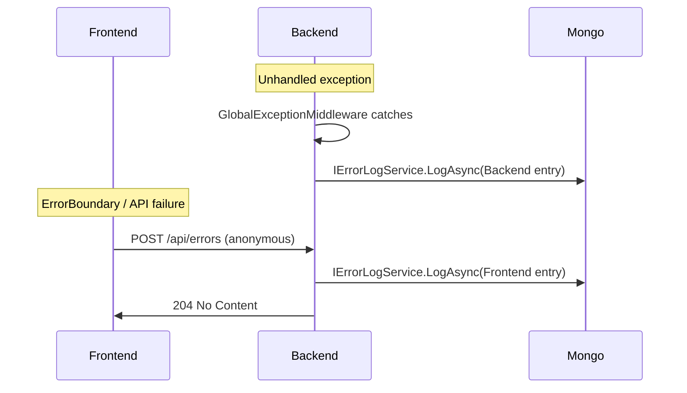

# MongoDB error logging (backend + frontend)

## Scope

- **Backend:** Persist all unhandled exceptions (from [GlobalExceptionMiddleware.cs](backend/src/WebAPI/Middlewares/GlobalExceptionMiddleware.cs)) into MongoDB with category and details.
- **Frontend:** Report React and runtime failures to a new error API (anonymous POST), which writes to the same MongoDB collection.
- **Database:** MongoDB only (no change to existing PostgreSQL usage).

## Architecture

---

## 1. Backend: MongoDB and error model

- **Package:** Add `MongoDB.Driver` to [WebAPI.csproj](backend/src/WebAPI/WebAPI.csproj).
- **Config:** Add a MongoDB connection string in [appsettings.json](backend/src/WebAPI/appsettings.json) and [appsettings.Development.json](backend/src/WebAPI/appsettings.Development.json) (e.g. `ConnectionStrings:MongoDb` or `MongoDb:ConnectionString`). Use a dedicated DB (e.g. `VoiceCallApp`) and collection (e.g. `ErrorLogs`).
- **Document model:** Define a single document type used for both backend and frontend, for example:
  - `Source`: `"Backend"` | `"Frontend"`
  - `OccurredAt`: UTC timestamp
  - `Category`: e.g. exception type name (backend) or `"React"` / `"Api"` (frontend)
  - `Message`: string
  - `StackTrace`: string (optional)
  - Backend-only (when `Source == "Backend"`): `RequestPath`, `RequestMethod`, etc.
  - Frontend-only (when `Source == "Frontend"`): `Url`, `UserAgent`, `ComponentStack` (from React error boundary), optional `UserId` if authenticated.
  - Optional: `Severity` (e.g. Error, Warning) and any extra key-value metadata.

Store these in a single collection with a discriminator (`Source`) so you can query/filter by backend vs frontend and by category.

---

## 2. Backend: Error logging service and DI

- **Interface:** `IErrorLogService` with a method such as `Task LogAsync(ErrorLogEntry entry, CancellationToken ct = default)`.
- **Implementation:** `MongoErrorLogService` that takes `IMongoDatabase` (or `IMongoCollection<BsonDocument>` / your document type), maps `ErrorLogEntry` to the document model above, and inserts into the `ErrorLogs` collection. Use fire-and-forget or non-blocking insert so that logging does not delay the HTTP response.
- **DI:** Register `MongoClient` and `IMongoDatabase` (from config), then register `IErrorLogService` as singleton or scoped with `MongoErrorLogService`.

---

## 3. Backend: Persist exceptions in GlobalExceptionMiddleware

- In [GlobalExceptionMiddleware.cs](backend/src/WebAPI/Middlewares/GlobalExceptionMiddleware.cs), inside the `catch` block:
  - Resolve `IErrorLogService` from `HttpContext.RequestServices` (do not inject scoped services in middleware constructor; resolve per request).
  - Build an `ErrorLogEntry` with `Source = Backend`, `Category = exception.GetType().Name`, `Message = ex.Message`, `StackTrace = ex.StackTrace`, and from `HttpContext`: path, method, etc.
  - Call `LogAsync`. Do not await in a way that blocks the response; either await a quick insert or fire-and-forget with minimal context (e.g. `_ = LogAsync(...)` and ensure no unobserved exceptions, or use a channel/queue if you prefer).
- Keep existing behavior: still return the same JSON response and status code as today; logging to MongoDB is additive.

---

## 4. Backend: Error report API for the frontend

- **Controller:** New `ErrorController` (or add to an existing controller) with a single action:
  - `POST /api/errors` (or `POST /api/error-report`).
  - **Auth:** `[AllowAnonymous]` so the frontend can report errors even when the user is not logged in (e.g. login page crash).
  - **Request body DTO:** e.g. `ReportErrorRequest`: `Message`, `StackTrace` (optional), `Url`, `UserAgent` (optional), `ComponentStack` (optional, from React `ErrorInfo`). Do not accept arbitrary user input for execution (sanitize or cap length if needed).
  - **Logic:** If the request has a valid JWT, optionally set `UserId` from claims; otherwise leave it null. Map to the same document shape as backend errors with `Source = Frontend`, `Category` e.g. `"React"` or from a request field, then call `IErrorLogService.LogAsync`.
  - **Response:** 204 No Content on success; 400 for invalid body. Avoid returning stack traces or internal details to the client.

---

## 5. Frontend: Report errors to the API

- **API client:** In [api.ts](backend/frontend/src/services/api.ts) (or a small dedicated module), add a function that POSTs to the backend error endpoint. Use the same base URL as existing API ([getApiBase](backend/frontend/src/services/api.ts) / `API_URL`); do not use the axios instance that triggers the 401/refresh and toasts for this call, or use a minimal axios instance without interceptors so error reporting does not show toasts or redirect. Send JSON: `{ message, stack, url: window.location.href, userAgent: navigator.userAgent, componentStack }`.
- **ErrorBoundary:** In [ErrorBoundary.tsx](backend/frontend/src/components/ErrorBoundary.tsx), inside `componentDidCatch(error, errorInfo)`, call the new report function with `error.message`, `error.stack`, and `errorInfo.componentStack`, then continue to render the existing “Something went wrong” UI. Ensure the report call does not throw (e.g. try/catch and at most `console.warn`).
- **Optional:** From the axios response interceptor, for non-401 errors, you can also call the report function with a short message and no componentStack (category e.g. `"Api"`) so frontend-perceived API failures are stored; avoid double-reporting the same error (e.g. only report when you do not rethrow in a way that would also hit the ErrorBoundary).

---

## 6. Configuration and deployment

- **MongoDB instance:** Provision a MongoDB (e.g. Liara MongoDB, or Atlas) and set the connection string in appsettings and/or environment variables. Ensure the WebAPI can reach it from the host where it runs.
- **Frontend:** No new env vars strictly required if the frontend already uses `VITE_API_URL` (or the same base as existing API); the error endpoint lives on the same backend.

---

## File-level summary

| Area                                                                                        | Action                                                                           |
| ------------------------------------------------------------------------------------------- | -------------------------------------------------------------------------------- |
| [WebAPI.csproj](backend/src/WebAPI/WebAPI.csproj)                                           | Add `MongoDB.Driver` package.                                                    |
| appsettings*.json                                                                           | Add MongoDB connection string.                                                   |
| New: Error document / DTOs                                                                  | Backend model + `ReportErrorRequest` for POST body.                              |
| New: IErrorLogService + MongoErrorLogService                                                | Interface and MongoDB insert implementation.                                     |
| [DependencyInjection.cs](backend/src/WebAPI/Configurations/DependencyInjection.cs)          | Register Mongo client, database, and `IErrorLogService`.                         |
| [GlobalExceptionMiddleware.cs](backend/src/WebAPI/Middlewares/GlobalExceptionMiddleware.cs) | Resolve `IErrorLogService`, build backend entry, call `LogAsync`.                |
| New: ErrorController                                                                        | POST `/api/errors` with `[AllowAnonymous]`, map to document, call `LogAsync`.    |
| [api.ts](backend/frontend/src/services/api.ts)                                              | Add `reportError(message, stack?, componentStack?)` (or similar) calling POST.   |
| [ErrorBoundary.tsx](backend/frontend/src/components/ErrorBoundary.tsx)                      | In `componentDidCatch`, call report with `error` and `errorInfo.componentStack`. |

This gives you a single MongoDB collection for all backend and frontend failures, categorized by source and category, so you can query and fix bugs and improve the app. MongoDB is the only new store; PostgreSQL remains for app data.